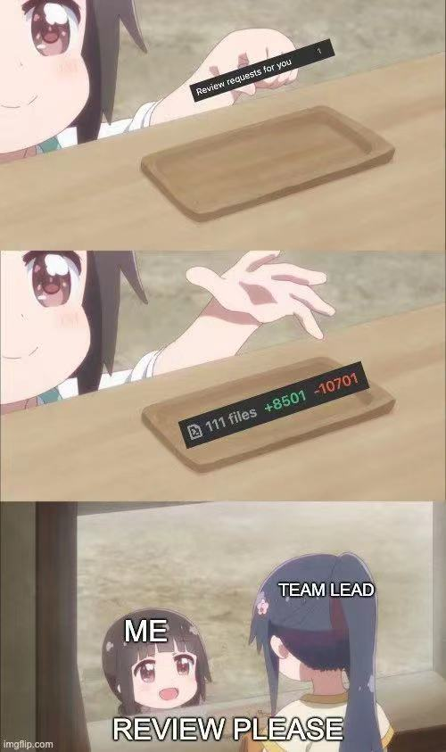

<a href="/">My Self Introduction!
</a>
<table>
  <tr>
   <td>
<h1>Junxuan Wu</h1>

<strong>University of Toronto</strong>
     
<strong>Bachelor of Computer Science</strong>
    </td>
<td>
Toronto, ON <strong>(647) 893-1068</strong>

<strong><a href="mailto:atrocitytheme@gmail.com">atrocitytheme@gmail.com</a></strong>

<strong><a href="mailto:junxuan.wu@mail.utoronto.ca">junxuan.wu@mail.utoronto.ca</a></strong>
   </td>
  </tr>
<tr>
   <td>
<h1>EXPERIENCE</h1>

<h2>Apache Software Foundation (Cloudstack)</h2>
     
Toronto, Canada — <em>GSoC Developer</em>
     
<strong>05 2021 - Present</strong>
     
<strong>Java, KVM/Qemu, OS virtualization, Cloud computing, Vuejs</strong>
Apache CloudStack is an open-source cloud computing platform belonging to Apache Software Foundation. 

I joined as one of the open-source software developers during the Google Summer of Code event. Fields working on
  
- Develop full-clone virtual machine function for KVM and the Virtualization Simulator for this IaaS cloud platform</h3>
- Research the optimization of Garbage Collection implementation of virtual hardware resources such as NiC and temporary snapshot of VMs.</h3>

<h2>Oracle (Eloqua Cloud), Toronto, Canada</h2>

<em>Software Development Coop</em>

<strong>05 2020 - 04 2021</strong>

<strong>Java/Ruby/typescript/python2, Cloud infrastructure, CI/CD, JVM, distributed system, Redis</strong>

Eloqua Cloud is a SaaS marketing cloud developed by Oracle. It’s a distributed business planner and market analysis cloud platform. 

I work for the infrastructure development team and collaborate closely with the Devops team to improve the cloud system and automation process (mainly on CI tool development). Project accomplishments:<strong> </strong>
<ul>

<li><strong>RMS portal system</strong>: A centralized management server that manages states of clusters, VMs, containers, load balancers, authentications of developers, and notification of development events according to a calendar system. This optimizes the efficiency of different dev teams and quicker identification of dev issues.

<li><strong>Uchiwa board agent system</strong>: A distributed log and control system based on Ruby Sensu agents. It provides quicker environmental setup and direct operational API of sensu agent clusters.

<li><strong>Automated database migration</strong>: An automation process to help Devops team migrate the mssql/oracle db automatically. MIgration time improves from a week of manual configurations to just 2 days. 

<h1>EDUCATION</h1>

<h2>University of Toronto, Toronto</h2>

<h3>Bachelor of <em>Computer Science</em></h3>

<h3><strong>Focus: Operating System and web development</strong></h3>

<h3>2017 - Present</h3>

</li>
</ul>
</td>
<td>

<h1>SKILLS</h1>
<ul>
<li>Java/Nodejs/C++/Python3
<li>Iaas/SaaS Application development and maintenance

<li>Cloud infrastructure management, OS virtualization (KVM/Qemu  OCI specific)

<li>CI/CD automation
<li>Distributed and concurrent computation
</ul>
<h1>AWARDS</h1>

<ul>
  <li>University of Toronto Dean’s list Scholar

  <li>Oracle 2020 Quarterly Coop Award
</ul>
<h1>PROJECTS</h1>

<ul><li>Reap the Flag (Application Server)  <em>https://github.com/atrocitytheme/Reap-Server</em></h2>
A multiplayer online fps game, it supports players in the same area network to connect and play together </li>
<li>
Reap the Flag (Unity Client) —<em>https://github.com/atrocitytheme/Reap-the-flag</em>
</li>
</ul>
   </td>
  </tr>
</table>
